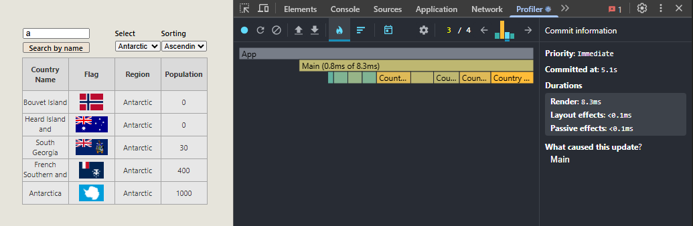
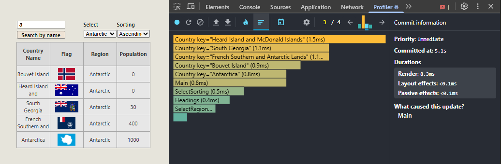
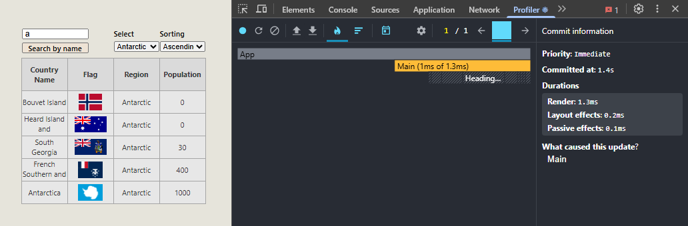
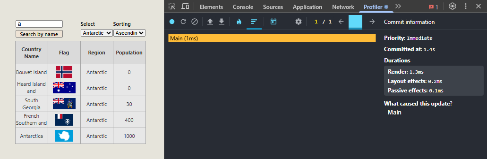

# React Performance Task

Below is a comparison for one particular action (changing the region filter from "All regions" to "Antarctic") recorded before and after application was optimised using memoisation (memo, useMemo, useCallback).

## Before the optimisation.

Render duration = 8,3 ms; Commit duration < 8,5 ms

## After the optimisation.

Render duration = 1,3 ms; Commit duration = 1,6 ms

As we can see, after optimisation with memoisation the number of re-renders has significantly decreased (Countries, Headings, Search and both Selects were not re-rendered) and the render time has become noticeably shorter for the commit (8,3ms before and 1,3ms after), as for the Main component, it stayed approximately the same - about 1 ms (0,8ms before and 1,3ms after).
